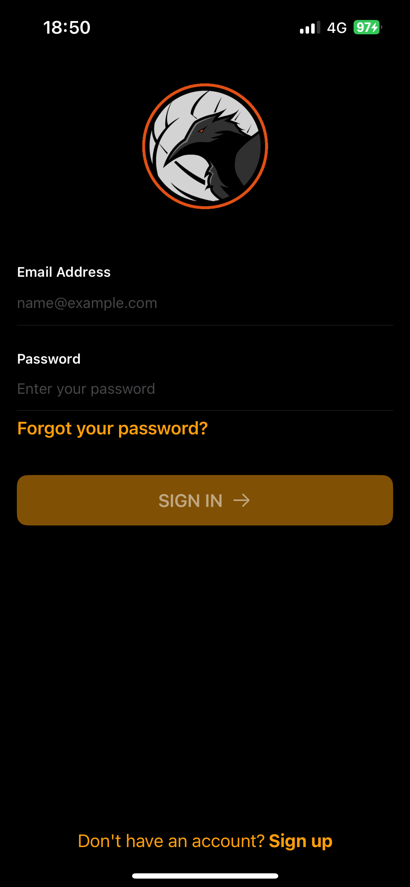
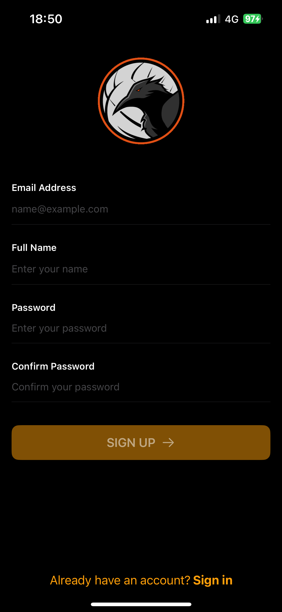
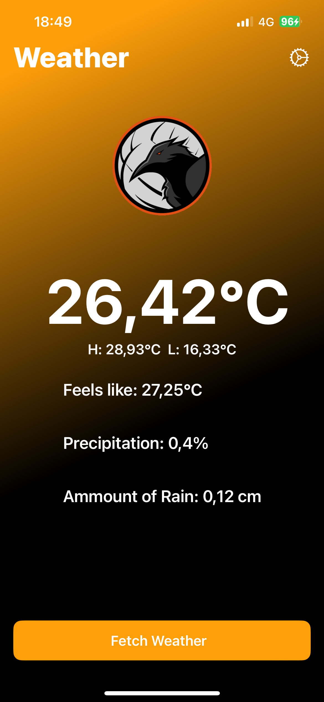
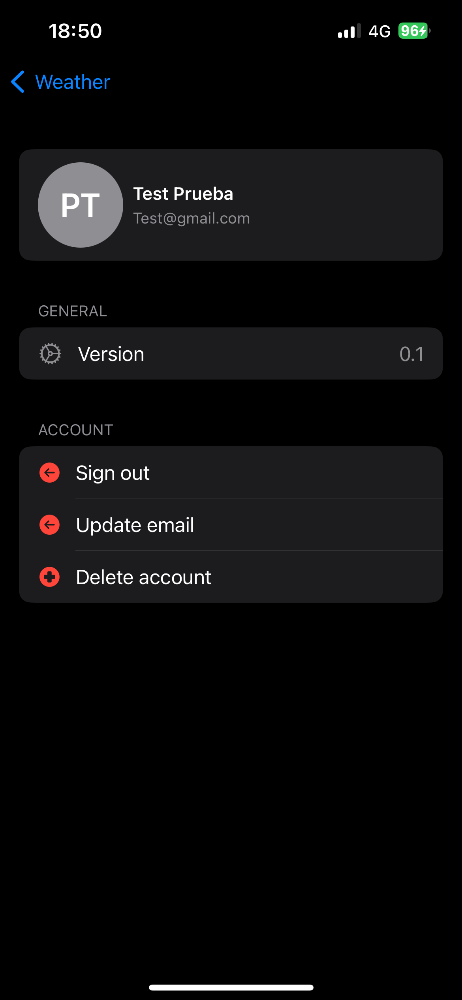

# Firebase-auth-example

This project is a weather application that uses Firebase for authentication and Firestore for data storage. It leverages CoreLocation to get the device's current location and WeatherKit to fetch weather data based on that location. The app provides real-time weather updates and stores user preferences securely.

## Frameworks

- **Firebase Authentication**: For user authentication and management.
- **Firestore**: For storing user data and application information.
- **CoreLocation**: To access the device's location services.
- **WeatherKit**: To fetch weather data based on the device's current location.

## Technical Proficiency

The project leverages modern, industry-standard technologies to provide a robust and scalable solution. By using Firebase for authentication and Firestore for data storage, the application ensures secure and efficient management of user data. CoreLocation and WeatherKit are integrated seamlessly to provide accurate and real-time weather data based on the user's current location.

## Elegance

The application's architecture is designed with modularity and maintainability in mind. Each component is responsible for a specific functionality, making the codebase clean and easy to manage. The user interface is intuitive and user-friendly, providing a smooth and engaging user experience. The use of Firebase and WeatherKit APIs reduces the complexity of handling authentication and data retrieval, allowing for a more streamlined and elegant implementation.

## Usefulness

This weather application addresses a common need for real-time weather updates based on the user's location. By integrating location services and weather data, the app provides personalized and relevant information to users. The secure authentication and data storage features ensure that user preferences and data are protected, enhancing the overall user experience. This makes the application not only a technical achievement but also a valuable tool for everyday use.

## Screenshots

### SignIn

### SignUp

### Reset Password

### Weather Conditions

### Profile

## Contact

Dylan Corvo - corvodylan@hotmail.com

Project Link: https://github.com/corvo-99/Firebase-auth-example

