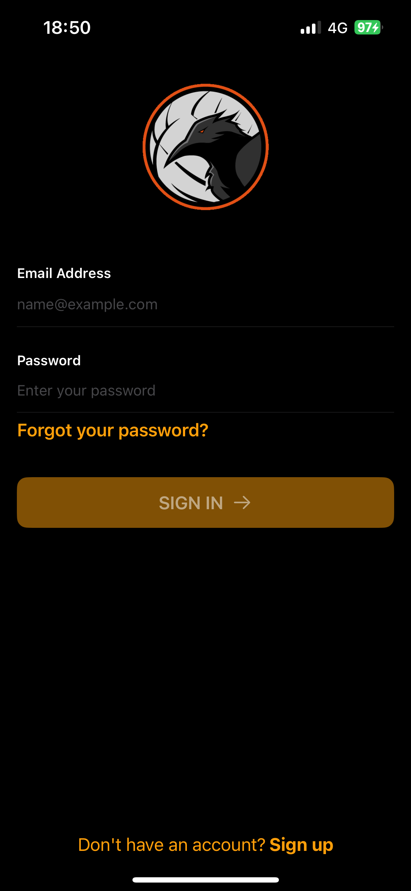

# Firebase-auth-example

This project is a weather application that uses Firebase for authentication and Firestore for data storage. It leverages CoreLocation to get the device's current location and WeatherKit to fetch weather data based on that location. The app provides real-time weather updates and stores user preferences securely.

## Frameworks

- **Firebase Authentication**: For user authentication and management.
- **Firestore**: For storing user data and application information.
- **CoreLocation**: To access the device's location services.
- **WeatherKit**: To fetch weather data based on the device's current location.

## Screenshots

### SignIn

### SignUp

### Reset Password

### Weather Conditions

### Profile

## Contact

Dylan Corvo - corvodylan@hotmail.com

Project Link: https://github.com/corvo-99/Firebase-auth-example

